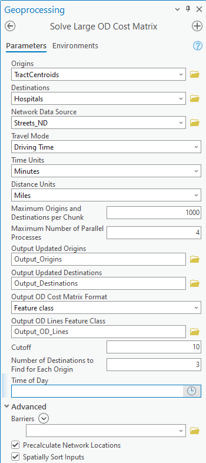
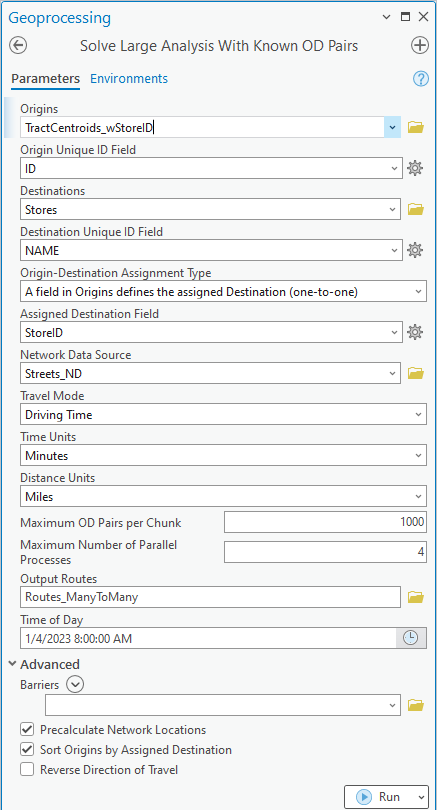
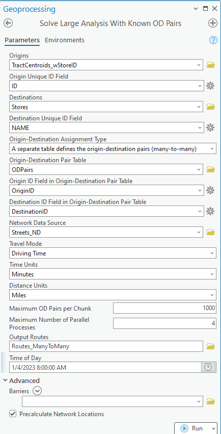

# large-network-analysis-tools

The tools and code samples here help you solve large network analysis problems in ArcGIS Pro.

We have provided two python script tools designed to solve large network analysis problems by splitting the input data into chunks and solving the chunks in parallel. You can use these tools as is, you can modify the provided scripts to suit your needs, or you can use them as an example when writing your own code.

## Features
The LargeNetworkAnalysisTools.pyt toolbox has two geoprocessing tools:
* *[Solve Large OD Cost Matrix](#Solve-Large-OD-Cost-Matrix-tool)* - solves a large origin destination cost matrix problem, and the results can be written to a feature class, a set of CSV files, or a set of Apache Arrow files
* *[Solve Large Analysis With Known OD Pairs](#Solve-Large-Analysis-With-Known-OD-Pairs-tool)* - generates routes between origins and preassigned destinations

## Requirements

* ArcGIS Pro 2.5 or later (ArcGIS Pro 2.9 or later is recommended for improved performance and functionality)
* One of the following three options:
  * A routable [network dataset](https://pro.arcgis.com/en/pro-app/help/analysis/networks/what-is-network-dataset-.htm) and the Network Analyst extension license
  * An ArcGIS Online account with routing privileges and sufficient [credits](https://pro.arcgis.com/en/pro-app/tool-reference/appendices/geoprocessing-tools-that-use-credits.htm#ESRI_SECTION1_3EF40A7C01C042D8A76DB9518B793E9E)
  * A portal with [ArcGIS Enterprise routing services](https://pro.arcgis.com/en/pro-app/help/analysis/networks/using-arcgis-enterprise-routing-services.htm) configured.
* Origin and destination points you wish to analyze

## Instructions

1. Download the latest release
2. Modify the code to suit your needs if desired
3. Run the code in standalone python, or run the provided geoprocessing tool from within ArcGIS Pro.

## Solve Large OD Cost Matrix tool

The *Solve Large OD Cost Matrix* tool can be used to solve a large [origin-destination cost matrix](https://pro.arcgis.com/en/pro-app/latest/help/analysis/networks/network-analyst-solver-types.htm#ESRI_SECTION1_A132772FF6C54FA6A594F2F6A1202570), calculating the travel time and distance from a set of origins to a set of destinations.  You can use a time or distance cutoff and a number of destinations to find for each origin to reduce the problem size, and the calculations are optimized by spatially sorting the inputs.  The tool can calculate extremely large OD cost matrices by chunking up the problem and solving in parallel.  You can choose to save the outputs to a feature class, set of CSV files, or set of Apache Arrow tables.

### Solve Large OD Cost Matrix tool inputs
- **Origins** (Python: *Origins*) - The feature class or layer containing the origins.
- **Destinations** (Python: *Destinations*) - The feature class or layer containing the destinations.
- **Network Data Source** (Python: *Network_Data_Source*) - Network dataset, network dataset layer, or portal URL to use when calculating the OD Cost Matrix.
- **Travel Mode** (Python: *Travel_Mode*) - Network travel mode to use when calculating the OD Cost Matrix
- **Time Units** (Python: *Time_Units*) - The time units the output Total_Time field will be reported in.
- **Distance Units** (Python: *Distance_Units*) - The distance units the output Total_Distance field will be reported in.
- **Maximum Origins and Destinations per Chunk** (Python: *Max_Inputs_Per_Chunk*) - Defines the chunk size for parallel OD Cost Matrix calculations. For example, if you want to process a maximum of 1000 origins and 1000 destinations in a single chunk, set this parameter to 1000.
- **Maximum Number of Parallel Processes** (Python: *Max_Processes*) - Defines the maximum number of parallel processes to run at once. Do not exceed the number of cores of your machine.
- **Output Updated Origins** (Python: *Output_Updated_Origins*) - Path to the output feature class that will contain the updated origins, which may be spatially sorted and have added fields. The OriginOID field in the Output OD Lines Feature Class refers to the ObjectID of the Output Updated Origins and not the original input origins.
- **Output Updated Destinations** (Python: *Output_Updated_Destinations*) - Path to the output feature class that will contain the updated destinations, which may be spatially sorted and have added fields. The DestinationOID field in the Output OD Lines Feature Class refers to the ObjectID of the Output Updated Destinations and not the original input destinations.
- **Output OD Cost Matrix Format** (Python: *Output_Format*) - The desired output format for the OD Cost Matrix Lines. The available choices are:
  - "Feature class" - A single, combined feature class. This option is the slowest to create and will likely fail for extremely large problems.
  - "CSV files" - A set of .csv files. Each file represents the OD Cost Matrix Lines output, without shape geometry, for a chunk of origins and a chunk of destinations, using the naming scheme `ODLines_O_#_#_D_#_#.csv`, where the `#` signs represent the ObjectID ranges of the origins and destinations in the chunk. If you have set a value for the Number of Destinations to Find for Each Origin parameter, you may find some output files using the naming scheme `ODLines_O_#_#.csv` because results from all destinations have been combined into one file.
  - "Apache Arrow files" - A set of Apache Arrow files. Each file represents the OD Cost Matrix Lines output, without shape geometry, for a chunk of origins and a chunk of destinations, using the naming scheme `ODLines_O_#_#_D_#_#.arrow`, where the `#` signs represent the ObjectID ranges of the origins and destinations in the chunk. If you have set a value for the Number of Destinations to Find for Each Origin parameter, you may find some output files using the naming scheme `ODLines_O_#_#.arrow` because results from all destinations have been combined into one file. This option is not available in versions of ArcGIS Pro prior to 2.9 and is not available if the network data source is a service.
- **Output OD Lines Feature Class** (Python: *Output_OD_Lines_Feature_Class*) - Path to the output feature class that will contain the OD Cost Matrix Lines output computed by the tool if the Output OD Cost Matrix Format parameter value is "Feature class". The schema of this feature class is described in the [arcpy documentation](https://pro.arcgis.com/en/pro-app/latest/arcpy/network-analyst/origindestinationcostmatrix-output-data-types.htm#ESRI_SECTION1_9FF9489173C741DD95472F21B5AD8374). Note that the OriginOID and DestinationOID fields refer to the ObjectIDs of the Output Updated Origins and Output Updated Destinations feature classes and not the original input data.
- **Output Folder** (Python: *Output_Folder*) - Path to a folder, which will be created by the tool, that will contain the CSV or Arrow files representing the OD Cost Matrix Lines results if the Output OD Cost Matrix Format parameter value is "CSV files" or "Apache Arrow files". The schema of the files is described in the [arcpy documentation](https://pro.arcgis.com/en/pro-app/latest/arcpy/network-analyst/origindestinationcostmatrix-output-data-types.htm#ESRI_SECTION1_9FF9489173C741DD95472F21B5AD8374), although the shape, OriginName, and DestinationName fields are not included in these outputs. Note that the OriginOID and DestinationOID fields refer to the ObjectIDs of the Output Updated Origins and Output Updated Destinations feature classes and not the original input data.
- **Cutoff** (Python: *Cutoff*) - Impedance cutoff limiting the search distance for each origin. For example, you could set up the problem to find only destinations within a 15 minute drive time of the origins. This parameter is optional. Leaving it blank uses no cutoff.
  - If your travel mode has time-based impedance units, Cutoff represents a time and is interpreted in the units specified in the Time Units parameter.
  - If your travel mode has distance-based impedance units, Cutoff represents a distance and is interpreted in the units specified in the Distance Units parameter.
  - If your travel mode has other units (not time- or distance-based), Cutoff should be specified in the units of your travel mode's impedance attribute.
- **Number of Destinations to Find for Each Origin** (Python: *Num_Destinations*) - The number of destinations to find for each origin. For example, setting this to 3 will result in the output including the travel time and distance from each origin to its three closest destinations. This parameter is optional. Leaving it blank results in finding the travel time and distance from each origin to all destinations.
- **Time of Day** (Python: *Time_Of_Day*) - The start time of day for the analysis. No value indicates a time neutral analysis.
- **Barriers** (Python: *Barriers*) - Point, line, or polygon barriers to use in the OD Cost Matrix analysis. This parameter is optional.
- **Precalculate Network Locations** (Python: *Precalculate_Network_Locations*) - When you solve a network analysis, the input points must "locate" on the network used for the analysis. When chunking your inputs to solve in parallel, inputs may be used many times. Rather than calculating the network location fields for each input every time it is used, it is more efficient to calculate all the network location fields up front and re-use them. Set this parameter to True to pre-calculate the network location fields. This is recommended for every situation unless:
  - You are using a portal URL as the network data source. In this case, pre-calculating network locations is not possible, and the parameter is hidden.
  - You have already pre-calculated the network location fields using the network dataset and travel mode you are using for this analysis. In this case, you can save time by not precalculating them again.

### Running the tool from ArcGIS Pro

You can run the tool in ArcGIS Pro just like any other geoprocessing tool. You just need to connect to the provided Python toolbox from the Catalog Pane either in the Toolboxes section or the Folders section.

If you plan to use ArcGIS Online or a portal as your network data source, make sure you're connected to that portal in your current Pro session.



### Running the tool from standalone Python

You can call the tool from your own standalone Python script.

As with any custom script tool, you must first import the toolbox within your standalone script:
`arcpy.ImportToolbox(<full path to LargeNetworkAnalysisTools.pyt>)`

Then, you can call the tool in your script:
`arcpy.LargeNetworkAnalysisTools.SolveLargeODCostMatrix(<tool parameters>)`

Here is the full tool signature:
```python
arcpy.LargeNetworkAnalysisTools.SolveLargeODCostMatrix(
    Origins, Destinations, Network_Data_Source, Travel_Mode, Time_Units, Distance_Units,
    Max_Inputs_Per_Chunk, Max_Processes, Output_Updated_Origins, Output_Updated_Destinations,
    Output_Format, Output_OD_Lines_Feature_Class, Output_Folder,
    Cutoff, Num_Destinations, Time_Of_Day, Barriers, Precalculate_Network_Locations
)
```

You can also run the provided scripts by directly calling solve_large_odcm.py from the command line instead of using the geoprocessing tool as the code's gateway. Call `python solve_large_odcm.py -h` to print the command line help to show you how to do this.

### Technical explanation of how this tool works

The tool consists of several scripts:
- **LargeNetworkAnalysisTools.pyt**: This defines the python toolbox and the tool as you see it in the ArcGIS Pro UI. It does some minimal parameter validation and calls solve_large_odcm.py to actually run the analysis.
- **solve_large_odcm.py**: This defines a class, `ODCostMatrixSolver`, that validates and preprocesses the inputs and then calls parallel_odcm.py as a subprocess to do the parallel solves. The class also parses log messages from the parallel_odcm.py and writes them out as geoprocessing messages.
- **parallel_odcm.py**: This script chunks the inputs, solves the OD Cost Matrices in parallel, and postprocesses the results.
- **od_config.py**: In this file, you can override some OD Cost Matrix analysis settings that are not included in the tool dialog. This is provided to make the scripts easier to customize so you don't have to dig through the more complex parts of the code to find these simple settings.
- **helpers.py**: Contains some helper methods and global variables.

Why do we have both solve_large_odcm.py and parallel_odcm.py? Why do we call parallel_odcm.py as a subprocess? This is necessary to accommodate running this tool from the ArcGIS Pro UI. A script tool running in the ArcGIS Pro UI cannot directly call multiprocessing using concurrent.futures. We must instead spin up a subprocess, and the subprocess must spawn parallel processes for the calculations. Thus, solve_large_odcm.py does all the pre-processing in the main python process, but it passes the inputs to parallel_odcm.py as a separate subprocess, and that subprocess can, in turn, spin up parallel processes for the OD Cost Matrix calculations.

Unit tests are available in the `unittests` folder and can help identify problems if you're editing the code.


## Solve Large Analysis With Known OD Pairs tool

The *Solve Large Analysis With Known OD Pairs* tool can be used to calculate the travel time and distance and generate routes between preassigned origin-destination pairs. It can calculate many routes simultaneously by chunking up the problem and solving in parallel.

Multiple types of origin-destination pairs are supported:
- one-to-one: A field in the input origins table indicates which destination the origin is assigned to. Each origin can be assigned to only one destination.
- many-to-many: A separate table defines the preassigned origin-destination pairs. A single origin may be assigned to multiple destinations.

### Solve Large Analysis With Known OD Pairs tool inputs
- **Origins** (Python: *Origins*) - The feature class or layer containing the origins.  Your origins dataset must have a field populated with the ID of the destination the origin is assigned to.  If your feature class includes fields in the [Route solver object input Stops schema](https://pro.arcgis.com/en/pro-app/latest/arcpy/network-analyst/route-input-data-types.htm#ESRI_SECTION1_D64F7E7B5196448B9B64CDD603BF8207), with the exception of "RouteName", "Sequence", and "LocationType", these fields will automatically be used in the analysis.
- **Origin Unique ID Field** (Python: *Origin_Unique_ID_Field*) - A field in origins representing the origin's unique ID.
- **Destinations** (Python: *Destinations*) - The feature class or layer containing the destinations. If your feature class includes fields in the [Route solver object input Stops schema](https://pro.arcgis.com/en/pro-app/latest/arcpy/network-analyst/route-input-data-types.htm#ESRI_SECTION1_D64F7E7B5196448B9B64CDD603BF8207), with the exception of "RouteName", "Sequence", and "LocationType", these fields will automatically be used in the analysis.
- **Destination Unique ID Field** (Python: *Destination_Unique_ID_Field*) -  A field in destinations representing the destination's unique ID.  The values in the origins table's Assigned Destination Field should correspond to these unique destination IDs.
- **Origin-Destination Assignment Type** (Python: *OD_Pair_Type*) - A text string indicating which type of preassigned origin-destination pairs to use for the analysis.  The options are:
  - `A field in Origins defines the assigned Destination (one-to-one)`
  - `A separate table defines the origin-destination pairs (many-to-many)`
- **Assigned Destination Field** (Python: *Assigned_Destination_Field*) - A field in Origins indicating the ID of the destination each origin is assigned to. Any origin with a null value or a value that does not match a valid destination ID will be ignored in the analysis.  This parameter is only applicable for the one-to-one Origin-Destination Assignment Type.
- **Origin-Destination Pair Table** (Python: *OD_Pair_Table*) - A table or CSV file defining origin-destination pairs. The table must be populated with a column of origin IDs matching values in the Origin Unique ID Field of the Origins table and a column of destination IDs matching values in the Destination Unique ID Field of the Destinations table.  This parameter is only applicable for the many-to-many Origin-Destination Assignment Type.
- **Origin ID Field in Origin-Destination Pair Table** (Python: *Pair_Table_Origin_Unique_ID_Field*) - The field name in the Origin-Destination Pair Table defining the origin IDs.  This parameter is only applicable for the many-to-many Origin-Destination Assignment Type.
- **Destination ID Field in Origin-Destination Pair Table** (Python: *Pair_Table_Destination_Unique_ID_Field*) - The field name in the Origin-Destination Pair Table defining the destination IDs.  This parameter is only applicable for the many-to-many Origin-Destination Assignment Type.
- **Network Data Source** (Python: *Network_Data_Source*) - Network dataset, network dataset layer, or portal URL to use when calculating the Route analysis.
- **Travel Mode** (Python: *Travel_Mode*) - Network travel mode to use when calculating the Route analysis.
- **Time Units** (Python: *Time_Units*) - The time units the output travel time will be reported in.
- **Distance Units** (Python: *Distance_Units*) - The distance units the output travel distance will be reported in.
- **Maximum OD Pairs per Chunk** (Python: *Max_Pairs_Per_Chunk*) - Defines the chunk size for parallel Route calculations, the number of origin-destination routes to calculate simultaneously. For example, if you want to process a maximum of 1000 origins and 1000 destinations in a single chunk, for a total of 1000 paired routes, set this parameter to 1000.
- **Maximum Number of Parallel Processes** (Python: *Max_Processes*) - Defines the maximum number of parallel processes to run at once. Do not exceed the number of cores of your machine.
- **Output Routes** (Python: *Output_Routes*) - Path to the output feature class that will contain the calculated routes between origins and their assigned destinations.  The schema of this feature class is described in the [arcpy documentation](https://pro.arcgis.com/en/pro-app/latest/arcpy/network-analyst/route-output-data-types.htm#ESRI_SECTION1_9FF9489173C741DD95472F21B5AD8374). The feature class's schema matches that described for the Routes table in the documentation, plus two additional fields, "OriginUniqueID" and "DestinationUniqueID", containing the unique ID field values for the origin and destination this route connects.
- **Time of Day** (Python: *Time_Of_Day*) - The start time of day for the analysis. No value indicates a time neutral analysis.
- **Barriers** (Python: *Barriers*) - Point, line, or polygon barriers to use in the OD Cost Matrix analysis. This parameter is optional.
- **Precalculate Network Locations** (Python: *Precalculate_Network_Locations*) - When you solve a network analysis, the input points must "locate" on the network used for the analysis. If origins and destinations are used more than once, it is more efficient to calculate the network location fields up front and re-use them.  Set this parameter to True to pre-calculate the network location fields. This is recommended unless:
  - You are using a portal URL as the network data source. In this case, pre-calculating network locations is not possible, and the parameter is hidden.
  - You have already pre-calculated the network location fields using the network dataset and travel mode you are using for this analysis. In this case, you can save time by not precalculating them again.
  - Each destination has only one assigned origin. In this case, there is no efficiency gain in calculating the location fields in advance.
- **Sort Origins by Assigned Destination** (Python: *Sort_Origins*) - A Boolean indicating whether to sort origins by their assigned destination prior to commencing the parallel solve.  Using sorted data will improve the efficiency of the solve slightly.  If your input data is already sorted, or if no origins are assigned to the same destinations, then sorting is not useful, and you should set this parameter to false.  This parameter is only applicable for the one-to-one Origin-Destination Assignment Type.
- **Reverse Direction of Travel** (Python: *Reverse_Direction*) - A Boolean indicating whether to reverse the direction of travel and calculate the route from the destination to the origin. The default is false.  This parameter is only applicable for the one-to-one Origin-Destination Assignment Type.

### Running the tool from ArcGIS Pro

You can run the tool in ArcGIS Pro just like any other geoprocessing tool. You just need to connect to the provided Python toolbox from the Catalog Pane either in the Toolboxes section or the Folders section.

If you plan to use ArcGIS Online or a portal as your network data source, make sure you're connected to that portal in your current Pro session.




### Running the tool from standalone Python

You can call the tool from your own standalone Python script.

As with any custom script tool, you must first import the toolbox within your standalone script:
`arcpy.ImportToolbox(<full path to LargeNetworkAnalysisTools.pyt>)`

Then, you can call the tool in your script:
`arcpy.LargeNetworkAnalysisTools.SolveLargeAnalysisWithKnownPairs(<tool parameters>)`

Here is the full tool signature:
```python
arcpy.LargeNetworkAnalysisTools.SolveLargeAnalysisWithKnownPairs(
    Origins, Origin_Unique_ID_Field, Destinations, Destination_Unique_ID_Field,
    OD_Pair_Type, Assigned_Destination_Field, OD_Pair_Table,
    Pair_Table_Origin_Unique_ID_Field, Pair_Table_Destination_Unique_ID_Field,
    Network_Data_Source, Travel_Mode, Time_Units, Distance_Units,
    Max_Pairs_Per_Chunk, Max_Processes, Output_Routes,
    Time_Of_Day, Barriers, Precalculate_Network_Locations, Sort_Origins, Reverse_Direction
)
```

You can also run the provided scripts by directly calling solve_large_route_pair_analysis.py from the command line instead of using the geoprocessing tool as the code's gateway. Call `python solve_large_route_pair_analysis.py -h` to print the command line help to show you how to do this.

### Technical explanation of how this tool works

The tool consists of several scripts:
- **LargeNetworkAnalysisTools.pyt**: This defines the python toolbox and the tool as you see it in the ArcGIS Pro UI. It does some minimal parameter validation and calls solve_large_route_pair_analysis.py to actually run the analysis.
- **solve_large_route_pair_analysis.py**: This defines a class, `RoutePairSolver`, that validates and preprocesses the inputs and then calls parallel_route_pairs.py as a subprocess to do the parallel solves. The class also parses log messages from the parallel_route_pairs.py and writes them out as geoprocessing messages.
- **parallel_route_pairs.py**: This script chunks the inputs, solves the Route analyses in parallel, and postprocesses the results.
- **rt_config.py**: In this file, you can override some Route analysis settings that are not included in the tool dialog. This is provided to make the scripts easier to customize so you don't have to dig through the more complex parts of the code to find these simple settings.
- **helpers.py**: Contains some helper methods and global variables.

Why do we have both solve_large_route_pair_analysis.py and parallel_route_pairs.py? Why do we call parallel_route_pairs.py as a subprocess? This is necessary to accommodate running this tool from the ArcGIS Pro UI. A script tool running in the ArcGIS Pro UI cannot directly call multiprocessing using concurrent.futures. We must instead spin up a subprocess, and the subprocess must spawn parallel processes for the calculations. Thus, solve_large_route_pair_analysis.py does all the pre-processing in the main python process, but it passes the inputs to parallel_route_pairs.py as a separate subprocess, and that subprocess can, in turn, spin up parallel processes for the Route calculations.

Unit tests are available in the `unittests` folder and can help identify problems if you're editing the code.

## Resources

* [OD Cost Matrix tutorial](https://pro.arcgis.com/en/pro-app/help/analysis/networks/od-cost-matrix-tutorial.htm)
* [Network Analyst arcpy.nax python module documentation](https://pro.arcgis.com/en/pro-app/arcpy/network-analyst/what-is-the-network-analyst-module.htm)
* [Video presentation about solving large problems from DevSummit 2021](https://www.esri.com/videos/watch?videoid=iD79ckvczlE)
* [Network Analyst code samples, presentations, and other resources](https://esri.github.io/network-analyst-resources/ )

## Issues

Find a bug or want to request a new feature?  Please let us know by submitting an issue.

## Contributing

Esri welcomes contributions from anyone and everyone. Please see our [guidelines for contributing](https://github.com/esri/contributing).

## Licensing
Copyright 2023 Esri

Licensed under the Apache License, Version 2.0 (the "License");
you may not use this file except in compliance with the License.
You may obtain a copy of the License at

   http://www.apache.org/licenses/LICENSE-2.0

Unless required by applicable law or agreed to in writing, software
distributed under the License is distributed on an "AS IS" BASIS,
WITHOUT WARRANTIES OR CONDITIONS OF ANY KIND, either express or implied.
See the License for the specific language governing permissions and
limitations under the License.

A copy of the license is available in the repository's [license.txt](license.txt) file.